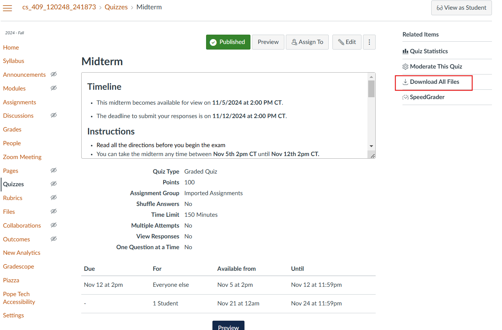
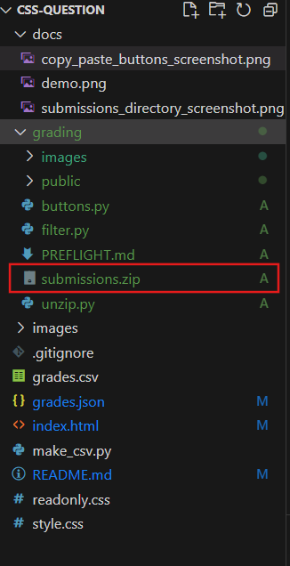
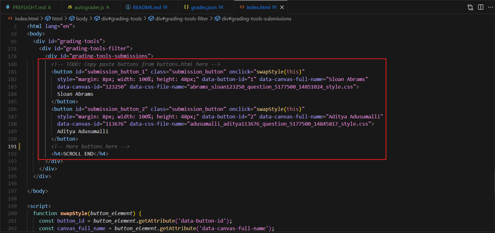
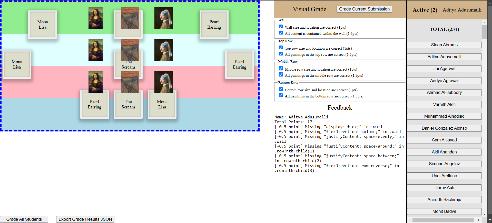

# AutoGrader

## Setup

1. Download the `submissions.zip`
  
    

2. Place the submissions in the `grading/` directory:

   

3. Run the following commands:

    ```shell
    # Make sure you are in the grading directory
    cd grading

    # Unzip the submissions
    python unzip.py submissions.zip --dest_dir .data/raw

    # Filter the submissions for css files
    #
    # Note: zip files will be filtered, but must be manually graded
    #
    python filter.py .data/raw --dest_dir .data/filtered

    # Make the html buttons
    python buttons.py .data/filtered/css
    ```

4. Copy paste all the html buttons into `index.html`:

    

5. Open `index.html` in the browser


## Usage



So i focused on UX or UI... here's a brief overview:

  * List of Buttons
      - Each button will swap the underlying css file submission
  * "Grade Current Submission" Button
      - Grade's the current "Active" student submission
      - Grade is stored as key-value pair in local storage
  * "Grade All Students" Button
      - Programmatically goes through the list of buttons, clicks each one to load student submission, then calls "Grade Current Submission"
          - This risks idempotency, but is good enough
  * "Download" Button
      - Console logs local storage key value pairs as on giant json string:
        ```json
        {
            "badia_alex123250_question_5177500_14851024_style.css": {
                "full_name": "Alex Badia",
                "canvas_id": "696969",
                "css_file_name": "badia_alex123250_question_5177500_14851024_style.css",
                "implementationPoints": 10,
                "visualPoints": 10,
                "totalPoints": 20,
                "comments": []
            },
        ...
        }
        ```

## Exporting Grades

1. Click "Grade All"
2. Wait (don't touch anything)
3. Click "Download" Button
4. Copy console logged JSON string and paste into `grades.json`
5. Run `make_csv.py` to convet `grades.json` to a csv file